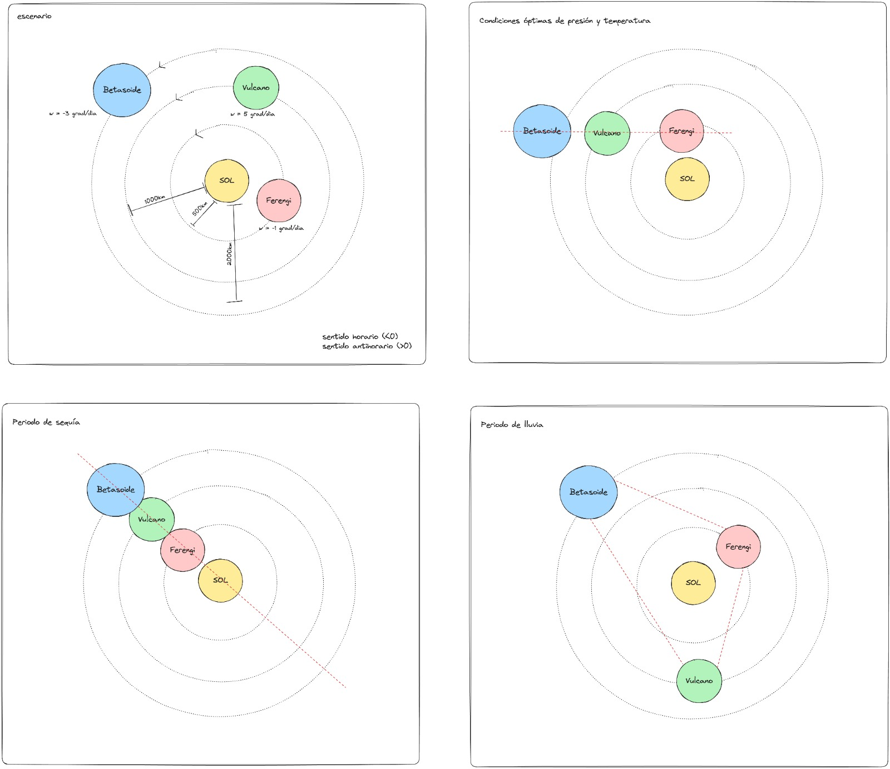
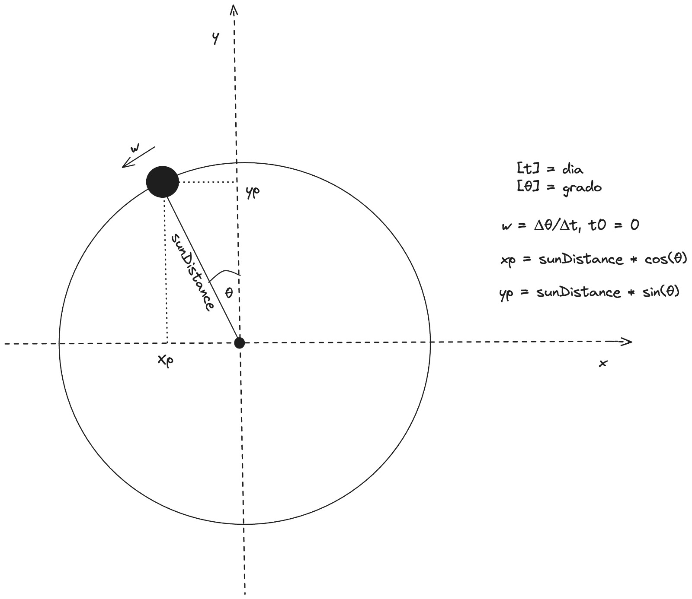
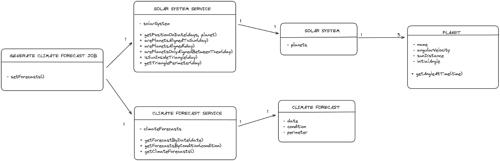

# Climate Forecast System
## Modelo del problema



## Supuestos
* Un año tiene 365 dias
* Se desprecia el radio del Sol y de los planetas, se los considera un punto en un eje de coordenadas cartesiano
* El Sol se ubica en el origen de coordenadas
* Se considera como tiempo inicial al dia 01/01/2024
* (xp, yp) son las coordenadas de un planeta
* Inicialmente, los tres planetas se encuentran en la posicion donde x = 0
* Si la posicion de los planetas no corresponde a ningun periodo conocido, se asume desconocido

## Diagrama de diseño



## Predicciones para los proximos 10 años
### Cantidad de periodos de sequia
11

### Cantidad de periodos de lluvia
1127

### Cantidad de picos de lluvia
40

### Cantidad de periodos de condiciones optimas de presion y temperatura
30

## Uso de la API
### Endpoint
http://localhost:8080/climate
#### Parametros
* __date__
  * en formato YYYY-mm-dd
* __condition__
  * las opciones posibles son:
    * DROUGHT
    * RAINY
    * MAX_RAINY
    * OPTIMUM_PRESSURE_AND_TEMPERATURE
    * OTHER

De no especificar ningun parametro, se retornan las predicciones para los siguientes 10 años
### Ejemplo de solicitud
```curl --location 'http://localhost:8080/climate?date=2025-05-30'```

### Formato de respuesta
```  
{
    "data": [
        {
            "date": "2025-05-30",
            "condition": "RAINY",
            "perimeter": 6135.92
        }
    ],
    "totalCount": 1
}
```

## Posibles Mejoras
* Paginar respuestas de API
* Devolver mensajes de error explicativos
* Persistir informacion en una base de datos, acceder a ellos mediante repositories
* Personalizar las Exceptions
* Creacion de planetas: se pueden tomar de un archivo csv o se pueden levantar de una base de datos